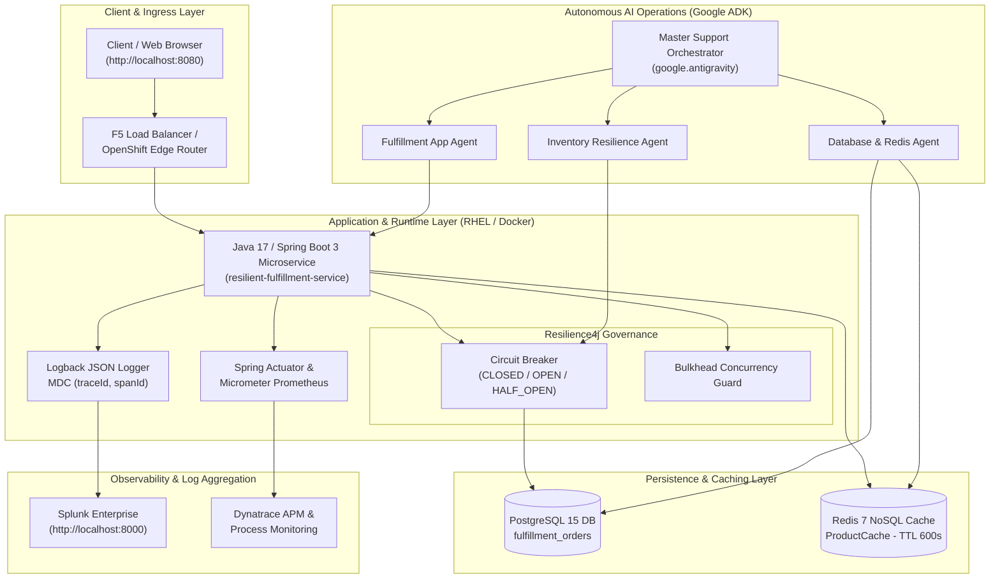
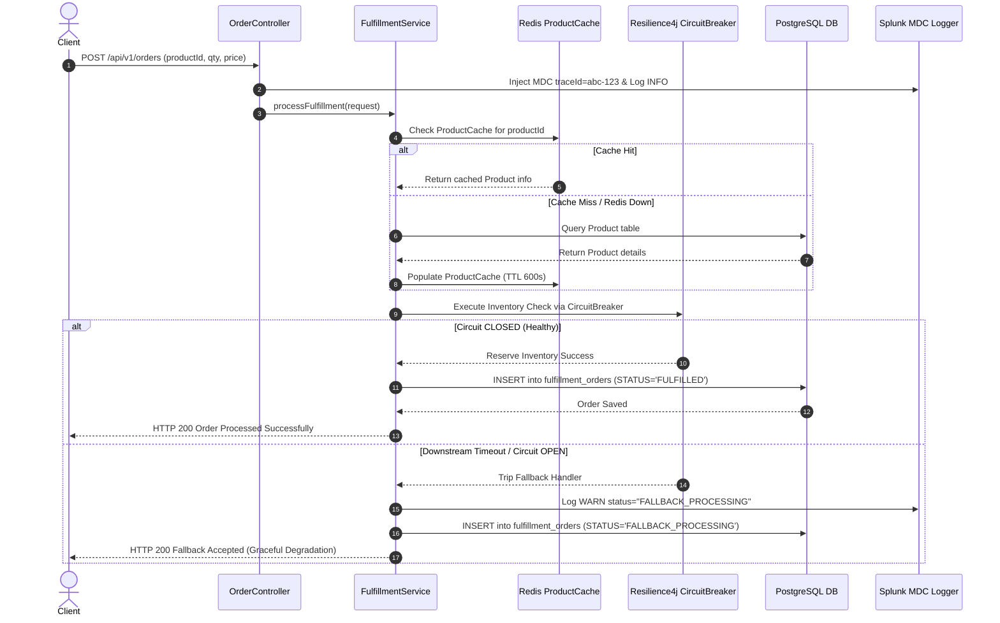
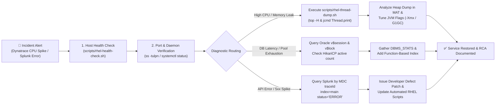
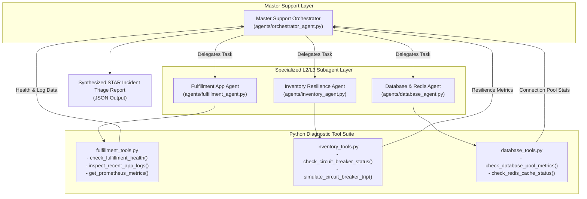
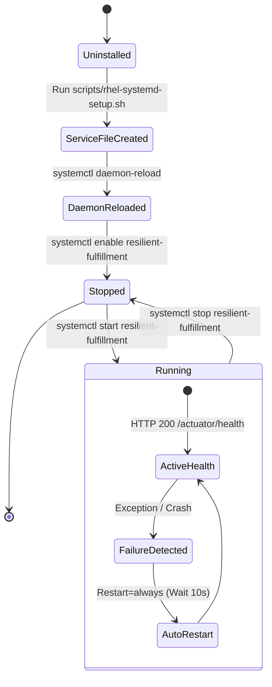

# 🏛️ Enterprise System Architecture & L2/L3 Operational Processes
## ResilientFulfillmentService — NexaBank Global Financial Platform Model

This comprehensive document breaks down all system architectures, request processing lifecycles, incident triage workflows, observability pipelines, and autonomous multi-agent AI operations within the **ResilientFulfillmentService** platform.

---

## 📐 1. Full Multi-Tier System Architecture Diagram

---

## ⚡ 2. Request Processing & Resilience Lifecycle

### Sequence Diagram: Order Processing, Caching & Fallback Execution

---

## 🛠️ 3. L2/L3 Incident Management & Triage Workflow

### Detailed Incident Triage Procedures

| Incident Type | Diagnostic Command / Tool | Action Plan & Root Cause Resolution |
| :--- | :--- | :--- |
| **High CPU / JVM Deadlock** | `scripts/rhel-thread-dump.sh` `top -H -p <pid>` `jcmd <pid> Thread.print` | 1. Convert LWP Thread ID to Hexadecimal (`printf "%x\n" <tid>`). 2. Search thread dump for `nid=0x<hex>` to identify blocked Java code. 3. Patch infinite loop or lock synchronization. |
| **OutOfMemoryError (`heap space`)** | `jcmd <pid> GC.heap_dump` Eclipse MAT | 1. Open `.hprof` in Eclipse MAT. 2. Run **Leak Suspects Report** and inspect **Dominator Tree**. 3. Identify static collections retaining unclosed references. 4. Tune JVM options (`-Xmx2g -Xmx4g -XX:+UseG1GC`). |
| **Database Connection Exhaustion** | Oracle `v$session`, `v$lock` `/actuator/prometheus` | 1. Monitor `hikaricp_connections_active` vs `hikaricp_connections_max`. 2. Inspect `v$session` for `STATUS='INACTIVE'` (unclosed JDBC leaks) vs `enqueue` wait events (locking). 3. Terminate blocking SID: `ALTER SYSTEM KILL SESSION 'sid,serial#' IMMEDIATE;`. |
| **Disk Full Outage (`/var/log`)** | `df -h /var/log` `lsof +L1 /var/log` | 1. If files were removed via `rm`, locate unreleased file handles using `lsof +L1`. 2. Truncate file descriptor to 0 bytes: `> /proc/<PID>/fd/<FD_NUM>`. 3. Configure `logrotate` with `copytruncate`. |

---

## 🤖 4. Autonomous Multi-Agent AI Operations (Google ADK)

---

## ⚙️ 5. RHEL Systemd Daemon Lifecycle

---

## 📑 6. Complete RHEL Automation Script Index

All scripts are stored in the [`scripts/`](file:///Users/anthonyjoyner/Documents/Projects/ResilientFulfillmentService/scripts/) directory:

| Script Name | Target Environment | Key Purpose | Primary Shell Commands Used |
| :--- | :--- | :--- | :--- |
| [`scripts/rhel-health-check.sh`](file:///Users/anthonyjoyner/Documents/Projects/ResilientFulfillmentService/scripts/rhel-health-check.sh) | RHEL 8/9 / Production | 5-minute automated host & app health monitoring. | `pgrep`, `free -m`, `curl`, `df -h`, `grep` |
| [`scripts/rhel-thread-dump.sh`](file:///Users/anthonyjoyner/Documents/Projects/ResilientFulfillmentService/scripts/rhel-thread-dump.sh) | RHEL 8/9 / Production | High CPU thread triage & JVM thread dump capture. | `top -H`, `jcmd`, `jstack`, `kill -3` |
| [`scripts/rhel-systemd-setup.sh`](file:///Users/anthonyjoyner/Documents/Projects/ResilientFulfillmentService/scripts/rhel-systemd-setup.sh) | RHEL 8/9 / Infrastructure | Provisioning systemd daemons with restart policies. | `useradd`, `systemctl daemon-reload`, `chmod` |
| [`scripts/system_health_check.sh`](file:///Users/anthonyjoyner/Documents/Projects/ResilientFulfillmentService/scripts/system_health_check.sh) | RHEL / OS Audit | System uptime & journalctl log aggregation. | `uptime`, `systemctl`, `journalctl` |
